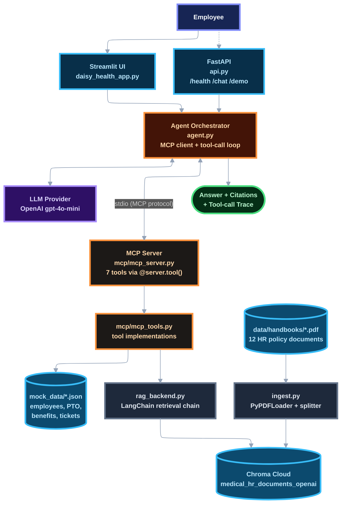
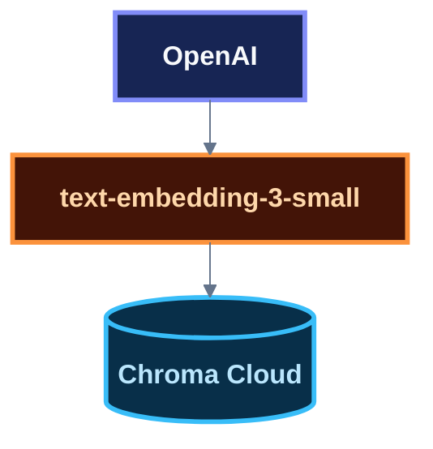
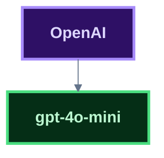
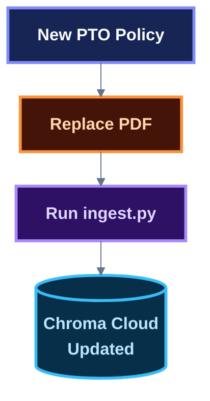
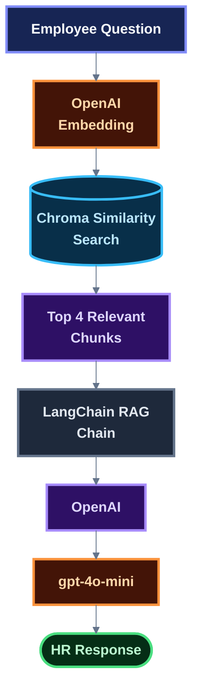

# Daisy Health — Agentic HR RAG Assistant

Daisy Health is an agentic AI system that helps employees at a hypothetical virtual-care company complete HR policy and operations tasks. It combines **Retrieval-Augmented Generation (RAG)** over a corpus of internal HR policy documents with an **agentic orchestration layer** that calls tools exposed by a **Model Context Protocol (MCP) server** to look up mock employee/PTO/benefits data, check policy compliance, and take mock actions (creating HR tickets, drafting emails).

The system uses **LangChain**, **Chroma Cloud**, OpenAI's `text-embedding-3-small`, the official **MCP Python SDK**, and OpenAI's `gpt-4o-mini` to produce grounded, cited, tool-driven responses.

---

## Features

Daisy is an HR assistant for **Daisy Health**, a hypothetical virtual primary-care company. It can:

- Answer HR policy questions grounded in retrieved documentation (PTO, benefits, remote work, expenses, HIPAA/data security, workplace conduct, onboarding, equipment, licensure/credentialing, holidays, performance & compensation)
- Look up an employee's profile, PTO balance, and benefits status from mock structured data
- Check whether a requested action (remote work, PTO, expense, benefits) is compliant with policy
- Create mock HR tickets and draft (unsent) HR emails as part of multi-step workflows
- Produce a visible tool-call trace and policy citations alongside every answer

The assistant is instructed to:

- Always look up the employee profile before answering personalized questions
- Ground every policy statement in a `search_policy_documents` call and cite the source
- Never invent policy or use outside knowledge
- Require the two demo workflows (expense compliance, HR case triage) to complete multi-tool chains rather than a single lookup
- Treat ticket creation / email drafting as **mock, reversible actions** — nothing is actually sent or submitted
- Direct the employee to `people@daisyhealth.com` when documentation is insufficient

---

# Tech Stack

| Technology                         | Role                                                                   |
| ---------------------------------- | ---------------------------------------------------------------------- |
| **Python**                         | Application language                                                   |
| **Streamlit**                      | Chat UI (`daisy_health_app.py`)                                        |
| **FastAPI**                        | `/health`, `/chat`, `/demo` API endpoints for the grader (`api.py`)    |
| **MCP Python SDK** (`mcp[cli]`)    | MCP server (`mcp/mcp_server.py`) exposing HR tools over stdio          |
| **agent.py**                       | Agent orchestrator — MCP client + tool-calling loop against the LLM    |
| **LangChain**                      | Orchestrates document loading, chunking, retrieval, and the RAG chain  |
| **OpenAI embeddings**              | Generates `text-embedding-3-small` vectors for documents and questions |
| **Chroma Cloud**                   | Stores document embeddings and performs similarity search              |
| **OpenAI**                         | `gpt-4o-mini` generates grounded employee-facing answers               |
| **PyPDFLoader**                    | Extracts text from HR PDF handbooks                                    |
| **RecursiveCharacterTextSplitter** | Splits documents into overlapping chunks for retrieval                 |
| **python-dotenv**                  | Loads environment variables from `.env`                                |
| **mock_data/\*.json**              | Synthetic employee, PTO, benefits, and HR ticket records               |

---

# System Architecture

Daisy Health has four cooperating layers:

1. **Web layer** — Streamlit chat UI + FastAPI `/health`, `/chat`, `/demo` endpoints
2. **Agent orchestrator** (`agent.py`) — an MCP client with deterministic workflow routing and an LLM synthesis step
3. **MCP server** (`mcp/mcp_server.py`) — exposes 7 tools over stdio, backed by `mcp/mcp_tools.py`
4. **Data layer** — the RAG index (Chroma Cloud, built by `ingest.py` from `data/handbooks/*.pdf`) and mock structured data (`mock_data/*.json`)

The agent never calls policy or employee logic directly — every tool invocation goes through the MCP client/server boundary using `session.call_tool(...)`. When the `search_policy_documents` tool is invoked, the agent also enriches the result with citation metadata (source file, page/section, snippet) pulled from the RAG retriever for display in the UI.



## MCP Tools

The MCP server (`mcp/mcp_server.py`) exposes these tools over stdio; the agent discovers them via `session.list_tools()` and calls them via `session.call_tool()`:

| Tool                      | Uses                                                                                 |
| ------------------------- | ------------------------------------------------------------------------------------ |
| `lookup_employee_profile` | mock data (`mock_data/employees.json`)                                               |
| `check_pto_balance`       | mock data (`mock_data/pto_balances.json`)                                            |
| `lookup_benefits_status`  | mock data (`mock_data/benefits.json`)                                                |
| `search_policy_documents` | RAG index (Chroma Cloud via `rag_backend.py`)                                        |
| `check_policy_compliance` | structured employee facts; final decisions are grounded in retrieved policy evidence |
| `create_mock_hr_ticket`   | mock action — writes to `mock_data/hr_tickets.json`                                  |
| `draft_hr_email`          | mock action — returns an unsent draft email                                          |

## Demo Workflows

1. **Expense compliance** — `lookup_employee_profile` → `search_policy_documents` → `check_policy_compliance`
2. **HR case triage** — `lookup_employee_profile` → `search_policy_documents` → `create_mock_hr_ticket` → `draft_hr_email`

Both are reproducible via `GET /demo` (returns sample requests) or `POST /chat`.

---

# How the RAG System Works

## 1. Document Ingestion

HR documents are stored as PDF files inside:

```text
data/
└── handbooks/
    ├── benefits_and_insurance.pdf
    ├── clinical_staff_policy.pdf
    ├── equipment_and_technology.pdf
    ├── expense_reimbursement.pdf
    ├── hipaa_and_data_security.pdf
    ├── holidays_and_schedule.pdf
    ├── licensure_and_credentialing.pdf
    ├── onboarding_policy.pdf
    ├── performance_and_compensation.pdf
    ├── pto_and_leave_policy.pdf
    ├── remote_work_policy.pdf
    └── workplace_conduct.pdf
```

`ingest.py` loads these documents using `PyPDFLoader`.

The extracted text is divided into smaller chunks using `RecursiveCharacterTextSplitter`.

The chunks are converted into vector embeddings using:

```text
text-embedding-3-small
```

The embeddings and document metadata are stored in a Chroma Cloud collection.

---

## 2. Vector Search

When an employee asks a question, the question is converted into an embedding using the **same OpenAI embedding model** used during ingestion.

For example:

```text
How can I use my PTO?
```

The question is represented as a vector and searched against the HR document embeddings stored in Chroma Cloud.

The application currently retrieves the top 4 results.

---

## 3. Context Construction

The retrieved document chunks are passed to the LangChain RAG pipeline.

The prompt contains:

```text
Retrieved HR documentation:

{context}

Employee question:

{input}
```

This gives the LLM the relevant HR policy information needed to answer the employee's question.

---

## 4. LLM Response

The retrieved context is supplied to `gpt-4o-mini` through OpenAI.

The model is instructed to:

- Use only the retrieved HR documentation
- Not invent policies
- Not use outside knowledge
- State when the documentation is insufficient
- Mention the source document when possible

This helps keep responses grounded in the organization's documents.

---

# Why Use RAG?

A general-purpose LLM does not automatically know Daisy Health's internal HR policies.

Instead of asking the model to memorize company policies, this system uses Retrieval-Augmented Generation:


This allows HR documents to be updated independently of the underlying LLM.

For example, if the PTO policy changes, the document can be updated and re-ingested without retraining the language model.

---

# API Keys and External Services

Daisy Health uses two external services.

## Chroma Cloud

Chroma Cloud stores the vector embeddings and provides similarity search.

Create an account:

[Chroma Cloud](https://www.trychroma.com/signup)

You will need:

- Chroma API Key
- Chroma Tenant ID
- Chroma Database name

The project uses:

```text
Database: HR_IT
Collection: medical_hr_documents_openai
```

## OpenAI

OpenAI provides the language model and embedding endpoints used by the application.

Create an account and obtain an API key:

[OpenAI](https://platform.openai.com/)

The application uses `gpt-4o-mini` for final response synthesis and `text-embedding-3-small` for retrieval.

---

# Embeddings

This project does **not** use OpenAI for embeddings.

Embeddings are generated locally using:

```text
text-embedding-3-small
```

The model runs locally on the development machine.

The embedding architecture is:



The language-model architecture is separate:



This separation allows the project to avoid a paid OpenAI embedding API while still using an external LLM provider.

---

# Prerequisites

Before running the application, make sure you have:

- Python 3 installed
- A Chroma Cloud account
- A Chroma Cloud API key
- A Chroma Cloud tenant ID
- A Chroma Cloud database
- An OpenAI API key
- HR PDF documents

---

# Installation

## 1. Clone the repository

```bash
git clone <https://github.com/Alex-is-Gonzalez/Daisy_Health/commits/alex-openAILMM>
cd Daisy_Health
```

## 2. Create a virtual environment

It is strongly recommended to use a virtual environment.

```bash
python3 -m venv .venv
```

## 3. Activate the virtual environment

### macOS / Linux

```bash
source .venv/bin/activate
```

### Windows

```powershell
.venv\Scripts\activate
```

## 4. Install dependencies

```bash
pip install -r requirements.txt
```

---

# Environment Variables

Create a file named `.env` in the root of the project.

```env
OPENAI_API_KEY=your_openai_api_key
CHROMADB_API_KEY=your_chroma_api_key
CHROMADB_TENANT=your_chroma_tenant_id
CHROMADB_DB=HR_IT
```

Replace the placeholder values with your actual credentials.

### Important

Never commit `.env` to GitHub.

Add the following to `.gitignore`:

```text
.env
.venv/
__pycache__/
```

---

# Project Structure

```text
Daisy_Health/
│
├── daisy_health_app.py     # Streamlit chat UI
├── api.py                  # FastAPI /health, /chat, /demo endpoints
├── agent.py                # Agent orchestrator (MCP client + tool-calling loop)
├── rag_backend.py           # LangChain RAG chain (Chroma Cloud retriever)
├── ingest.py                # Document ingestion pipeline
├── health_check.py
├── requirements.txt
├── README.md
├── .env
├── .gitignore
│
├── mcp/
│   ├── mcp_server.py        # MCP server — exposes 7 tools over stdio
│   └── mcp_tools.py          # Tool implementations shared by server + Streamlit
│
├── mock_data/
│   ├── employees.json
│   ├── pto_balances.json
│   ├── benefits.json
│   └── hr_tickets.json
│
├── evaluation/
│   ├── evaluation_questions.py
│   └── run_eval.py
│
└── data/
    └── handbooks/
        ├── benefits_and_insurance.pdf
        ├── clinical_staff_policy.pdf
        ├── equipment_and_technology.pdf
        ├── expense_reimbursement.pdf
        ├── hipaa_and_data_security.pdf
        ├── holidays_and_schedule.pdf
        ├── licensure_and_credentialing.pdf
        ├── onboarding_policy.pdf
        ├── performance_and_compensation.pdf
        ├── pto_and_leave_policy.pdf
        ├── remote_work_policy.pdf
        └── workplace_conduct.pdf
```

---

# Running the Application

There are three processes. The MCP server is launched automatically by `agent.py` as a stdio subprocess — you do not start it separately.

```text
ingest.py                          → build/update the Chroma knowledge base (run once, or after doc changes)
streamlit run daisy_health_app.py  → chat UI (spawns the MCP server + agent per request)
uvicorn api:app --port 8000        → /health, /chat, /demo for the grader (optional, separate terminal)
```

---

# Step 1 — Ingest the HR Documents

Run:

```bash
python3 ingest.py
```

This will:

1. Find the PDF files in `data/handbooks`
2. Extract their text
3. Split the text into chunks
4. Generate OpenAI embeddings
5. Upload the embeddings to Chroma Cloud
6. Store metadata about the source documents

You should see output similar to:

```text
Daisy Health - HR Document Ingestion
-------------------------------------
Chroma database: HR_IT
Collection: medical_hr_documents_openai
Embedding model: text-embedding-3-small

Loading HR documents...
Loaded XX pages.
Created XXX chunks.
Adding documents to Chroma Cloud...
Documents successfully added to Chroma Cloud.
Chroma collection count: XXX
```

## When should `ingest.py` be run?

You do **not** need to run `ingest.py` every time you use the assistant.

Run it when:

- Setting up the project for the first time
- Adding new HR documents
- Updating existing HR policies
- Rebuilding the vector database

For example:



### Important: Avoid duplicate ingestion

The current ingestion process uses `add_documents()`.

Running `ingest.py` repeatedly against the same collection can add duplicate document chunks.

For a clean rebuild, use a new/empty collection or clear the existing collection before re-ingesting.

The current collection is:

```text
medical_hr_documents_openai
```

This collection is separate from the older:

```text
medical_hr_documents
```

collection that may contain embeddings generated with the previous OpenAI embedding setup.

---

# Step 2 — Start the HR Assistant

After the documents have been ingested, run the Streamlit UI:

```bash
streamlit run daisy_health_app.py
```

Select an employee (e.g. `EMP-001`) in the sidebar and ask a question in the chat input. Each question runs the full pipeline in `agent.py`: it spawns the MCP server as a stdio subprocess, discovers its tools, applies the documented deterministic workflow policy, and produces a final, cited answer using the MCP results.

Optionally, in a second terminal, start the API for the grader:

```bash
uvicorn api:app --port 8000 --reload
```

```bash
curl http://localhost:8000/health
curl -X POST http://localhost:8000/chat \
     -H "Content-Type: application/json" \
     -d '{"question": "Can I expense a home office chair?", "employee_id": "EMP-002"}'
```

The question is passed to the agent orchestrator, which calls MCP tools (employee lookup, PTO/benefits data, policy search, compliance checks) as needed and returns an answer grounded in the retrieved HR policy chunks, along with a tool-call trace and citations.

---

# Example RAG Request

An employee asks:

```text
How can I use my PTO?
```

The system performs:



The response should be based on the contents of the retrieved PTO and leave documentation.

---

# Source Metadata

During ingestion, each document chunk receives metadata including:

```text
document_type = medical_hr
source_file = <original PDF filename>
```

This allows the application to associate retrieved information with the document from which it originated.

For example:

```text
source_file:
pto_and_leave_policy.pdf
```

The prompt also instructs the assistant to mention the source document when possible.

---

# Design Decisions

## Local Embeddings

The project uses OpenAI `text-embedding-3-small` consistently for ingestion and query retrieval.

Benefits include:

- No OpenAI embedding API cost
- Embeddings run locally
- The same embedding model can be used for ingestion and queries
- Suitable for semantic document search

It is important that the same embedding model is used when:

1. Creating document embeddings during ingestion
2. Embedding employee questions during retrieval

---

## Chroma Cloud

Chroma Cloud is used as the vector database.

The application stores:

- Document chunks
- Vector embeddings
- Document metadata

The RAG application does not need to load the entire document collection into memory when answering a question.

Instead, it performs similarity search and retrieves the most relevant chunks.

---

## OpenAI

OpenAI provides the `gpt-4o-mini` response model and `text-embedding-3-small` embedding model. The same embedding model is used at ingestion and query time.

---

## LangChain

LangChain coordinates the RAG workflow.

It is responsible for:

- Embedding integration
- Vector store integration
- Retrieval
- Prompt construction
- Document context injection
- LLM invocation
- RAG chain orchestration

---

# Security and Privacy Considerations

This project is a demonstration and should **not** be treated as a production HR or medical-data system without additional security controls.

The repository should never contain:

- API keys
- Employee personally identifiable information
- Protected health information (PHI)
- Confidential employee records
- Production HR documents

Use synthetic or publicly appropriate documents when sharing the project publicly.

For a production deployment, additional controls would be required, including:

- Authentication
- Authorization
- Role-based access control
- Audit logging
- Encryption
- Data-retention controls
- Access controls
- Appropriate compliance review

---
