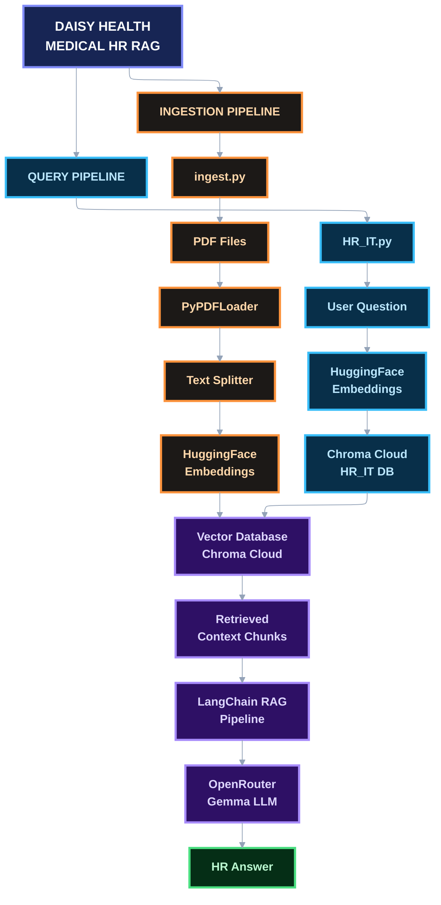
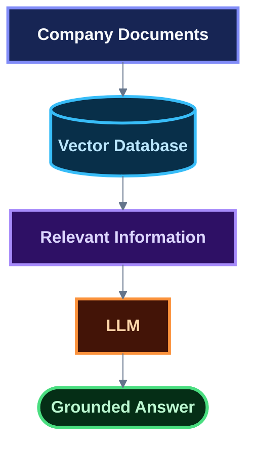
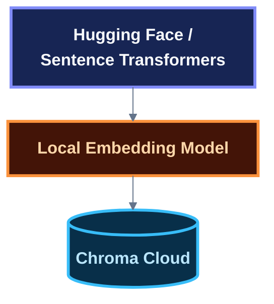
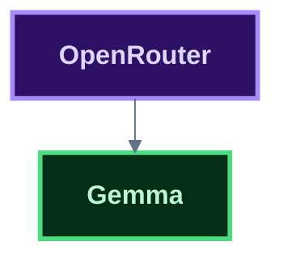
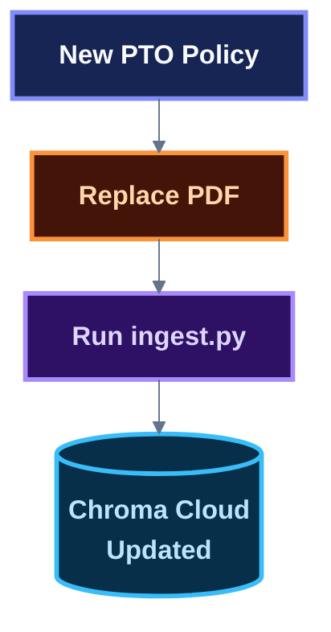
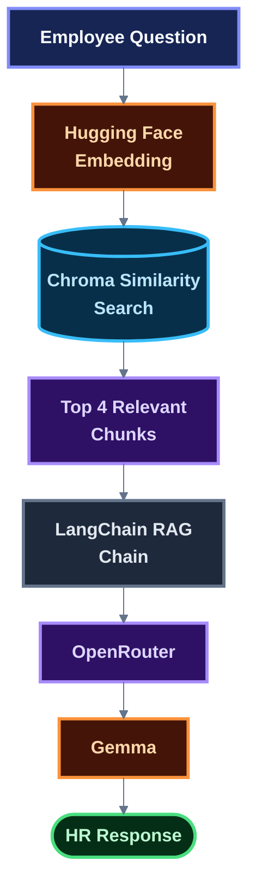
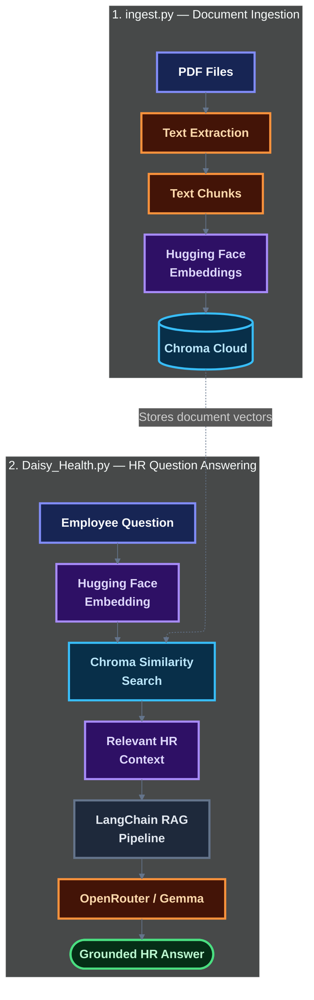

# Daisy Health — Medical HR RAG Assistant

Daisy Health is a Retrieval-Augmented Generation (RAG) application designed to answer employee HR questions using a controlled collection of medical-organization HR documents.

The system uses **LangChain**, **Chroma Cloud**, **Hugging Face embeddings**, and **OpenRouter** to retrieve relevant HR policy information and generate grounded responses.

The project demonstrates how document ingestion, vector search, retrieval, and an LLM can be combined while restricting responses to an organization's internal documentation.

---

## Features

Daisy Health acts as an HR assistant for a medical organization.

It can answer questions about:

- PTO
- Benefits
- FMLA
- HIPAA training
- Employee handbooks
- Compliance
- Credentialing
- Scheduling
- Leave policies
- Workplace policies
- HR procedures

The assistant is instructed to:

- Answer questions using only retrieved HR documentation
- Avoid inventing company policies
- Avoid using outside knowledge
- Identify the source document when possible
- Tell the employee when the available documentation is insufficient

If the system cannot find enough information to answer a question, it responds:

> "I don't know based on the available HR documentation. Please e-mail HR at people@daisyhealth.com"

---

# Tech Stack

| Technology                               | Role                                                                         |
| ---------------------------------------- | ---------------------------------------------------------------------------- |
| **Python**                               | Application programming language                                             |
| **LangChain**                            | Orchestrates document processing, retrieval, prompting, and the RAG workflow |
| **Hugging Face / Sentence Transformers** | Generates embeddings locally for HR documents and employee questions         |
| **Chroma Cloud**                         | Stores document embeddings and performs similarity search                    |
| **OpenRouter**                           | Provides the LLM API endpoint                                                |
| **Gemma**                                | Generates the final HR response from retrieved context                       |
| **PyPDFLoader**                          | Extracts text from HR PDF documents                                          |
| **RecursiveCharacterTextSplitter**       | Splits documents into smaller chunks for retrieval                           |
| **python-dotenv**                        | Loads environment variables from `.env`                                      |

---

# System Design

Daisy Health is divided into two major pipelines:

1. **Document Ingestion Pipeline**
2. **Query / RAG Pipeline**

The ingestion pipeline prepares company documents for retrieval.

The query pipeline retrieves relevant information from Chroma Cloud and provides that information to the LLM as context.



---

# How the RAG System Works

## 1. Document Ingestion

HR documents are stored as PDF files inside:

```text
data/
└── handbooks/
    ├── benefits_and_insurance.pdf
    ├── clinical_staff_policy.pdf
    ├── equipment_and_technology.pdf
    ├── expense_reimbursement.pdf
    ├── hipaa_and_data_security.pdf
    ├── holidays_and_schedule.pdf
    ├── licensure_and_credentialing.pdf
    ├── onboarding_policy.pdf
    ├── performance_and_compensation.pdf
    ├── pto_and_leave_policy.pdf
    ├── remote_work_policy.pdf
    └── workplace_conduct.pdf
```

`ingest.py` loads these documents using `PyPDFLoader`.

The extracted text is divided into smaller chunks using `RecursiveCharacterTextSplitter`.

The chunks are converted into vector embeddings using:

```text
sentence-transformers/all-MiniLM-L6-v2
```

The embeddings and document metadata are stored in a Chroma Cloud collection.

---

## 2. Vector Search

When an employee asks a question, the question is converted into an embedding using the **same Hugging Face embedding model** used during ingestion.

For example:

```text
How can I use my PTO?
```

The question is represented as a vector and searched against the HR document embeddings stored in Chroma Cloud.

The application currently retrieves the top 4 results.

---

## 3. Context Construction

The retrieved document chunks are passed to the LangChain RAG pipeline.

The prompt contains:

```text
Retrieved HR documentation:

{context}

Employee question:

{input}
```

This gives the LLM the relevant HR policy information needed to answer the employee's question.

---

## 4. LLM Response

The retrieved context is sent to the Gemma model through OpenRouter.

The model is instructed to:

- Use only the retrieved HR documentation
- Not invent policies
- Not use outside knowledge
- State when the documentation is insufficient
- Mention the source document when possible

This helps keep responses grounded in the organization's documents.

---

# Why Use RAG?

A general-purpose LLM does not automatically know Daisy Health's internal HR policies.

Instead of asking the model to memorize company policies, this system uses Retrieval-Augmented Generation:



This allows HR documents to be updated independently of the underlying LLM.

For example, if the PTO policy changes, the document can be updated and re-ingested without retraining the language model.

---

# API Keys and External Services

Daisy Health uses two external services.

## Chroma Cloud

Chroma Cloud stores the vector embeddings and provides similarity search.

Create an account:

[Chroma Cloud](https://www.trychroma.com/signup)

You will need:

- Chroma API Key
- Chroma Tenant ID
- Chroma Database name

The project uses:

```text
Database: HR_IT
Collection: medical_hr_documents_hf
```

## OpenRouter

OpenRouter provides access to the language model used to generate the final response.

Create an account and obtain an API key:

[OpenRouter](https://openrouter.ai/)

The application currently uses a Gemma model through OpenRouter.

---

# Embeddings

This project does **not** use OpenAI for embeddings.

Embeddings are generated locally using:

```text
sentence-transformers/all-MiniLM-L6-v2
```

The model runs locally on the development machine.

The embedding architecture is:



The language-model architecture is separate:



This separation allows the project to avoid a paid OpenAI embedding API while still using an external LLM provider.

---

# Prerequisites

Before running the application, make sure you have:

- Python 3 installed
- A Chroma Cloud account
- A Chroma Cloud API key
- A Chroma Cloud tenant ID
- A Chroma Cloud database
- An OpenRouter API key
- HR PDF documents

---

# Installation

## 1. Clone the repository

```bash
git clone <your-repository-url>
cd Daisy_Health
```

## 2. Create a virtual environment

It is strongly recommended to use a virtual environment.

```bash
python3 -m venv .venv
```

## 3. Activate the virtual environment

### macOS / Linux

```bash
source .venv/bin/activate
```

### Windows

```powershell
.venv\Scripts\activate
```

## 4. Install dependencies

```bash
pip install -r requirements.txt
```

---

# Environment Variables

Create a file named `.env` in the root of the project.

```env
OPENROUTER_API_KEY=your_openrouter_api_key
CHROMADB_API_KEY=your_chroma_api_key
CHROMADB_TENANT=your_chroma_tenant_id
CHROMADB_DB=HR_IT
```

Replace the placeholder values with your actual credentials.

### Important

Never commit `.env` to GitHub.

Add the following to `.gitignore`:

```text
.env
.venv/
__pycache__/
```

---

# Project Structure

```text
Daisy_Health/
│
├── Daisy_Health.py
├── ingest.py
├── requirements.txt
├── README.md
├── .env
├── .gitignore
│
└── data/
    └── handbooks/
        ├── benefits_and_insurance.pdf
        ├── clinical_staff_policy.pdf
        ├── equipment_and_technology.pdf
        ├── expense_reimbursement.pdf
        ├── hipaa_and_data_security.pdf
        ├── holidays_and_schedule.pdf
        ├── licensure_and_credentialing.pdf
        ├── onboarding_policy.pdf
        ├── performance_and_compensation.pdf
        ├── pto_and_leave_policy.pdf
        ├── remote_work_policy.pdf
        └── workplace_conduct.pdf
```

---

# Running the Application

There are two separate processes:

```text
ingest.py
    ↓
Build/update the Chroma knowledge base

HR_IT.py
    ↓
Run the HR assistant
```

They do not need to be run at the same time.

---

# Step 1 — Ingest the HR Documents

Run:

```bash
python3 ingest.py
```

This will:

1. Find the PDF files in `data/handbooks`
2. Extract their text
3. Split the text into chunks
4. Generate Hugging Face embeddings
5. Upload the embeddings to Chroma Cloud
6. Store metadata about the source documents

You should see output similar to:

```text
Daisy Health - HR Document Ingestion
-------------------------------------
Chroma database: HR_IT
Collection: medical_hr_documents_hf
Embedding model: all-MiniLM-L6-v2

Loading HR documents...
Loaded XX pages.
Created XXX chunks.
Adding documents to Chroma Cloud...
Documents successfully added to Chroma Cloud.
Chroma collection count: XXX
```

## When should `ingest.py` be run?

You do **not** need to run `ingest.py` every time you use the assistant.

Run it when:

- Setting up the project for the first time
- Adding new HR documents
- Updating existing HR policies
- Rebuilding the vector database

For example:



### Important: Avoid duplicate ingestion

The current ingestion process uses `add_documents()`.

Running `ingest.py` repeatedly against the same collection can add duplicate document chunks.

For a clean rebuild, use a new/empty collection or clear the existing collection before re-ingesting.

The current Hugging Face collection is:

```text
medical_hr_documents_hf
```

This collection is separate from the older:

```text
medical_hr_documents
```

collection that may contain embeddings generated with the previous OpenAI embedding setup.

---

# Step 2 — Start the HR Assistant

After the documents have been ingested, run:

```bash
python3 HR_IT.py
```

You should see:

```text
Daisy Health HR Assistant
--------------------
Using OpenRouter + Chroma Cloud
Embeddings: Hugging Face

Chroma documents: XXX
```

You can then ask questions:

```text
Question: How can I use my PTO?
```

The question is embedded, searched against Chroma Cloud, and the most relevant HR policy chunks are provided to Gemma.

---

# Example RAG Request

An employee asks:

```text
How can I use my PTO?
```

The system performs:



The response should be based on the contents of the retrieved PTO and leave documentation.

---

# Source Metadata

During ingestion, each document chunk receives metadata including:

```text
document_type = medical_hr
source_file = <original PDF filename>
```

This allows the application to associate retrieved information with the document from which it originated.

For example:

```text
source_file:
pto_and_leave_policy.pdf
```

The prompt also instructs the assistant to mention the source document when possible.

---

# Design Decisions

## Local Embeddings

The project uses `all-MiniLM-L6-v2` instead of a paid embedding API.

Benefits include:

- No OpenAI embedding API cost
- Embeddings run locally
- The same embedding model can be used for ingestion and queries
- Suitable for semantic document search

It is important that the same embedding model is used when:

1. Creating document embeddings during ingestion
2. Embedding employee questions during retrieval

---

## Chroma Cloud

Chroma Cloud is used as the vector database.

The application stores:

- Document chunks
- Vector embeddings
- Document metadata

The RAG application does not need to load the entire document collection into memory when answering a question.

Instead, it performs similarity search and retrieves the most relevant chunks.

---

## OpenRouter

OpenRouter provides the language model endpoint.

The application uses LangChain's OpenAI-compatible `ChatOpenAI` interface with OpenRouter's API endpoint.

This allows the application to interact with the selected Gemma model while keeping the LLM provider separate from the rest of the RAG architecture.

---

## LangChain

LangChain coordinates the RAG workflow.

It is responsible for:

- Embedding integration
- Vector store integration
- Retrieval
- Prompt construction
- Document context injection
- LLM invocation
- RAG chain orchestration

---

# Security and Privacy Considerations

This project is a demonstration and should **not** be treated as a production HR or medical-data system without additional security controls.

The repository should never contain:

- API keys
- Employee personally identifiable information
- Protected health information (PHI)
- Confidential employee records
- Production HR documents

Use synthetic or publicly appropriate documents when sharing the project publicly.

For a production deployment, additional controls would be required, including:

- Authentication
- Authorization
- Role-based access control
- Audit logging
- Encryption
- Data-retention controls
- Access controls
- Appropriate compliance review

---

# Portfolio Summary

Daisy Health demonstrates a complete Retrieval-Augmented Generation architecture for an internal HR knowledge base.

The project separates document ingestion from application inference:



This separation allows the knowledge base to be updated independently of the conversational application and demonstrates the core components of a production-style RAG system.

---
